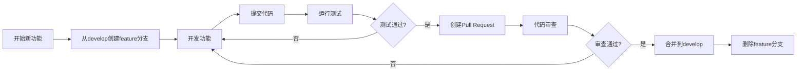

# Git 分支管理策略

## 项目概述
- **项目名称**: 狼人杀小程序服务端
- **技术栈**: Node.js + TypeScript + Mongoose + Socket.IO + Redis
- **开发模式**: 多模块并行开发
- **团队规模**: 中小型团队（2-10人）

---

## 一、分支架构设计

### 1.1 分支结构图

```
main (生产分支)
  │
  ├─ develop (开发主分支)
  │     │
  │     ├─ feature/user (✅ 已完成)
  │     ├─ feature/clan (✅ 已完成)
  │     ├─ feature/contest (✅ 已完成)
  │     ├─ feature/countdown (✅ 已完成)
  │     ├─ feature/currency (✅ 已完成)
  │     ├─ feature/goods (✅ 已完成)
  │     ├─ feature/team (✅ 已完成)
  │     ├─ feature/title (✅ 已完成)
  │     ├─ feature/room (🔧 调试中)
  │     ├─ feature/game (🔧 调试中)
  │     ├─ feature/* (🚧 其他模块开发中)
  │     │
  │     ├─ hotfix/* (紧急修复分支)
  │     └─ release/* (发布分支)
  │
  └─ tags/v*.*.* (版本标签)
```

### 1.2 分支类型说明

| 分支类型 | 命名规范 | 生命周期 | 用途 |
|---------|---------|---------|------|
| **main** | `main` | 永久 | 生产环境分支，始终保持稳定可部署状态 |
| **develop** | `develop` | 永久 | 开发主分支，集成所有已完成的feature分支 |
| **feature** | `feature/<module-name>` | 临时 | 功能开发分支，每个模块一个分支 |
| **hotfix** | `hotfix/<issue-id>` | 临时 | 生产环境紧急修复分支 |
| **release** | `release/v<version>` | 临时 | 发布准备分支，用于版本发布前的最后测试 |
| **tags** | `v<major>.<minor>.<patch>` | 永久 | 版本标签，标记重要的发布版本 |

---

## 二、模块化分支管理

### 2.1 模块状态分类

#### ✅ 已完成模块（可合并到develop）
以下模块已完成开发，代码已通过测试，可以合并到develop分支：

| 模块名称 | 分支名称 | 状态 | 说明 |
|---------|---------|------|------|
| User | `feature/user` | ✅ 已完成 | 用户管理模块 |
| clan | `feature/clan` | ✅ 已完成 | 公会管理模块 |
| contest | `feature/contest` | ✅ 已完成 | 比赛管理模块 |
| CountDown | `feature/countdown` | ✅ 已完成 | 倒计时模块 |
| currency | `feature/currency` | ✅ 已完成 | 货币系统模块 |
| goods | `feature/goods` | ✅ 已完成 | 商品管理模块 |
| Team | `feature/team` | ✅ 已完成 | 团队管理模块 |
| Title | `feature/title` | ✅ 已完成 | 称号系统模块 |

#### 🔧 调试中模块（独立开发分支）
以下模块正在调试中，需要保持独立开发环境：

| 模块名称 | 分支名称 | 状态 | 说明 |
|---------|---------|------|------|
| Room | `feature/room` | 🔧 调试中 | 房间管理模块，独立调试环境 |
| Game | `feature/game` | 🔧 调试中 | 游戏逻辑模块，独立调试环境 |

#### 🚧 开发中模块（与主分支隔离）
以下模块正在开发中，需要与主分支保持隔离：

| 模块名称 | 分支名称 | 状态 | 说明 |
|---------|---------|------|------|
| Announcement | `feature/announcement` | 🚧 开发中 | 公告系统 |
| Reward | `feature/reward` | 🚧 开发中 | 奖励系统 |
| Active | `feature/active` | 🚧 开发中 | 活动系统 |
| 其他模块 | `feature/*` | 🚧 开发中 | 其他待开发模块 |

---

## 三、分支工作流程

### 3.1 功能开发流程



**详细步骤：**

1. **创建功能分支**
   ```bash
   # 从develop分支创建新的feature分支
   git checkout develop
   git pull origin develop
   git checkout -b feature/<module-name>
   ```

2. **开发功能**
   - 在feature分支上进行开发
   - 遵循项目代码规范
   - 定期提交代码（建议每完成一个小功能就提交）

3. **提交代码**
   ```bash
   git add .
   git commit -m "feat(module): 简短描述

   - 详细说明1
   - 详细说明2

   Closes #issue-id"
   ```

4. **运行测试**
   ```bash
   # 运行类型检查
   pnpm run typecheck

   # 运行测试
   pnpm run test

   # 运行代码检查
   pnpm run lint
   ```

5. **创建Pull Request**
   - 推送到远程仓库
   - 创建Pull Request到develop分支
   - 填写PR模板，描述变更内容

6. **代码审查**
   - 至少一名团队成员审查
   - 检查代码质量、安全性、性能
   - 提出修改建议或直接批准

7. **合并到develop**
   ```bash
   # Squash合并（推荐）
   git checkout develop
   git merge --squash feature/<module-name>
   git commit -m "feat(module): 合并功能分支"

   # 或使用Merge Request的Squash and merge选项
   ```

8. **删除feature分支**
   ```bash
   # 删除本地分支
   git branch -d feature/<module-name>

   # 删除远程分支
   git push origin --delete feature/<module-name>
   ```

### 3.2 已完成模块合并流程

对于已完成的模块（User、clan、contest等），按以下流程合并：

```bash
# 1. 确保develop分支最新
git checkout develop
git pull origin develop

# 2. 合并已完成的feature分支
git merge feature/user
git merge feature/clan
git merge feature/contest
git merge feature/countdown
git merge feature/currency
git merge feature/goods
git merge feature/team
git merge feature/title

# 3. 解决冲突（如果有）
# 手动解决冲突后：
git add .
git commit -m "chore: 解决合并冲突"

# 4. 推送到远程
git push origin develop

# 5. 删除已合并的feature分支
git branch -d feature/user
git branch -d feature/clan
# ... 其他分支

# 6. 删除远程分支
git push origin --delete feature/user
git push origin --delete feature/clan
# ... 其他分支
```

### 3.3 调试分支隔离策略

Room和Game模块需要独立调试环境，采用以下策略：

#### 策略1：独立分支 + 独立配置
```bash
# 创建Room调试分支
git checkout -b feature/room-debug
# 修改配置文件指向测试环境
# 运行调试服务器

# 创建Game调试分支
git checkout -b feature/game-debug
# 修改配置文件指向测试环境
# 运行调试服务器
```

#### 策略2：独立数据库
```bash
# 在feature/room分支中
# 使用独立的Redis数据库：redis_room_test
# 使用独立的MongoDB数据库：werewolf_room_test

# 在feature/game分支中
# 使用独立的Redis数据库：redis_game_test
# 使用独立的MongoDB数据库：werewolf_game_test
```

#### 策略3：独立端口
```bash
# Room模块调试端口：3001
# Game模块调试端口：3002
# 主分支端口：3000
```

### 3.4 紧急修复流程

```bash
# 1. 从main创建hotfix分支
git checkout main
git pull origin main
git checkout -b hotfix/<issue-id>

# 2. 修复问题
# ... 修复代码 ...

# 3. 提交并测试
git add .
git commit -m "fix: 修复紧急问题 #<issue-id>"
pnpm run test

# 4. 合并到main和develop
git checkout main
git merge hotfix/<issue-id>
git tag -a v<version> -m "Release version <version>"
git push origin main --tags

git checkout develop
git merge hotfix/<issue-id>
git push origin develop

# 5. 删除hotfix分支
git branch -d hotfix/<issue-id>
git push origin --delete hotfix/<issue-id>
```

### 3.5 发布流程

```bash
# 1. 从develop创建release分支
git checkout develop
git pull origin develop
git checkout -b release/v<version>

# 2. 准备发布
# 更新版本号
# 更新CHANGELOG
# 最后测试

# 3. 合并到main并打标签
git checkout main
git merge --no-ff release/v<version>
git tag -a v<version> -m "Release version <version>"
git push origin main --tags

# 4. 合并回develop
git checkout develop
git merge --no-ff release/v<version>
git push origin develop

# 5. 删除release分支
git branch -d release/v<version>
git push origin --delete release/v<version>
```

---

## 四、分支命名规范

### 4.1 命名规则

| 分支类型 | 命名格式 | 示例 |
|---------|---------|------|
| 功能分支 | `feature/<module-name>` | `feature/user`, `feature/room` |
| 功能分支（带描述） | `feature/<module-name>-<description>` | `feature/room-debug` |
| 修复分支 | `fix/<issue-id>-<description>` | `fix/123-login-error` |
| 热修复分支 | `hotfix/<issue-id>-<description>` | `hotfix/456-critical-bug` |
| 发布分支 | `release/v<version>` | `release/v1.0.0` |
| 重构分支 | `refactor/<description>` | `refactor/user-service` |
| 文档分支 | `docs/<description>` | `docs/api-update` |

### 4.2 提交信息规范

遵循 [Conventional Commits](https://www.conventionalcommits.org/) 规范：

```
<type>(<scope>): <subject>

<body>

<footer>
```

**Type 类型：**
- `feat`: 新功能
- `fix`: 修复bug
- `docs`: 文档更新
- `style`: 代码格式调整
- `refactor`: 代码重构
- `perf`: 性能优化
- `test`: 测试相关
- `build`: 构建配置更新
- `chore`: 其他杂项

**示例：**
```
feat(user): 添加用户登录功能

- 实现JWT认证
- 添加密码加密
- 增加登录日志

Closes #123
```

---

## 五、代码审查流程

### 5.1 Pull Request 模板

创建PR时需要填写以下信息：

```markdown
## 变更类型
- [ ] 新功能 (feat)
- [ ] Bug修复 (fix)
- [ ] 代码重构 (refactor)
- [ ] 文档更新 (docs)
- [ ] 性能优化 (perf)
- [ ] 其他 (chore)

## 变更描述
<!-- 简要描述本次PR的主要变更内容 -->

## 相关Issue
<!-- 关联的Issue编号，如：Closes #123 -->

## 测试情况
- [ ] 单元测试通过
- [ ] 集成测试通过
- [ ] 手动测试通过
- [ ] 代码检查通过 (pnpm run lint)
- [ ] 类型检查通过 (pnpm run typecheck)

## 截图或演示
<!-- 如果是UI变更，请提供截图或GIF -->

## 检查清单
- [ ] 代码遵循项目规范
- [ ] 已添加必要的注释
- [ ] 已更新相关文档
- [ ] 无console.log或调试代码
- [ ] 无敏感信息泄露
```

### 5.2 审查标准

**必须检查项：**
- ✅ 代码符合项目规范
- ✅ 无安全漏洞
- ✅ 无性能问题
- ✅ 测试覆盖率达标
- ✅ 无console.log或调试代码
- ✅ 提交信息规范

**建议检查项：**
- 💡 代码可读性
- 💡 代码复用性
- 💡 错误处理完整性
- 💡 注释清晰度

---

## 六、冲突解决策略

### 6.1 常见冲突场景

1. **同一文件的不同修改**
   ```bash
   # 查看冲突
   git status
   git diff

   # 手动解决冲突
   # 编辑冲突文件，选择保留的内容

   # 标记冲突已解决
   git add <conflicted-file>
   git commit
   ```

2. **分支合并冲突**
   ```bash
   # 使用merge工具
   git mergetool

   # 或使用rebase
   git rebase develop
   # 解决冲突后
   git rebase --continue
   ```

3. **远程分支冲突**
   ```bash
   # 拉取最新代码
   git pull origin develop

   # 或使用fetch + rebase
   git fetch origin
   git rebase origin/develop
   ```

### 6.2 预防冲突的最佳实践

- ✅ 定期同步develop分支到feature分支
- ✅ 小步提交，频繁推送
- ✅ 避免长时间不合并
- ✅ 合并前先pull最新代码
- ✅ 使用清晰的提交信息

---

## 七、分支保护规则

### 7.1 main分支保护

```yaml
保护规则:
  - 需要Pull Request
  - 至少1个审查批准
  - 禁用直接推送
  - 要求状态检查通过:
    - CI/CD测试通过
    - 代码检查通过
    - 类型检查通过
```

### 7.2 develop分支保护

```yaml
保护规则:
  - 需要Pull Request
  - 至少1个审查批准
  - 禁用直接推送
  - 要求状态检查通过:
    - CI/CD测试通过
    - 代码检查通过
    - 类型检查通过
```

---

## 八、团队协作注意事项

### 8.1 日常开发规范

1. **开始工作前**
   ```bash
   # 确保本地分支最新
   git checkout develop
   git pull origin develop

   # 创建新的feature分支
   git checkout -b feature/<module-name>
   ```

2. **开发过程中**
   ```bash
   # 频繁提交
   git add .
   git commit -m "feat: 描述"

   # 定期推送
   git push origin feature/<module-name>
   ```

3. **结束工作时**
   ```bash
   # 确保所有更改已提交
   git status

   # 推送到远程
   git push origin feature/<module-name>
   ```

### 8.2 分支同步策略

```bash
# 每天开始工作前同步develop
git checkout develop
git pull origin develop

# 将develop的更新合并到feature分支
git checkout feature/<module-name>
git merge develop
# 或使用rebase
git rebase develop
```

### 8.3 清理无用分支

```bash
# 查看已合并的分支
git branch --merged

# 删除本地已合并的分支
git branch -d <branch-name>

# 查看未合并的分支
git branch --no-merged

# 强制删除分支（谨慎使用）
git branch -D <branch-name>

# 清理远程已删除的分支
git remote prune origin
```

---

## 九、版本标签管理

### 9.1 标签命名规范

```
v<major>.<minor>.<patch>

示例:
- v1.0.0 (第一个正式版本)
- v1.0.1 (Bug修复)
- v1.1.0 (新功能)
- v2.0.0 (重大更新)
```

### 9.2 创建标签

```bash
# 创建轻量标签
git tag v1.0.0

# 创建附注标签（推荐）
git tag -a v1.0.0 -m "Release version 1.0.0"

# 推送标签到远程
git push origin v1.0.0
git push origin --tags
```

### 9.3 查看标签

```bash
# 列出所有标签
git tag

# 查看标签详情
git show v1.0.0

# 检出标签
git checkout v1.0.0
```

---

## 十、最佳实践总结

### ✅ 推荐做法

1. **分支管理**
   - 每个功能使用独立的feature分支
   - 定期同步develop分支
   - 及时删除已合并的分支
   - 使用有意义的分支名称

2. **提交规范**
   - 遵循Conventional Commits规范
   - 频繁提交，小步快跑
   - 提交信息清晰明确
   - 关联相关Issue

3. **代码审查**
   - 所有代码必须经过审查
   - 及时响应审查意见
   - 保持开放和建设性的态度
   - 学习他人的代码风格

4. **冲突处理**
   - 预防为主，及时同步
   - 手动解决冲突，仔细检查
   - 解决后立即测试
   - 记录冲突原因

### ❌ 避免做法

1. **分支管理**
   - ❌ 在main或develop分支直接开发
   - ❌ 长时间不合并feature分支
   - ❌ 创建过多无用分支
   - ❌ 使用不清晰的分支名称

2. **提交规范**
   - ❌ 一次提交包含过多变更
   - ❌ 提交信息不清晰
   - ❌ 提交调试代码
   - ❌ 忘记提交文件

3. **代码审查**
   - ❌ 跳过代码审查直接合并
   - ❌ 审查时态度不友好
   - ❌ 忽视审查意见
   - ❌ 审查流于形式

4. **冲突处理**
   - ❌ 强制推送解决冲突
   - ❌ 不测试就提交冲突解决
   - ❌ 随意选择冲突内容
   - ❌ 不记录冲突原因

---

## 十一、故障排查指南

### 11.1 常见问题

**问题1：无法推送分支**
```bash
# 解决方案：拉取最新代码后推送
git pull origin feature/<module-name>
git push origin feature/<module-name>
```

**问题2：合并后代码无法运行**
```bash
# 解决方案：回退合并，检查问题
git reset --hard HEAD~1
# 重新检查代码后再合并
```

**问题3：分支丢失**
```bash
# 解决方案：查看reflog找回
git reflog
# 找到分支的commit hash
git branch <branch-name> <commit-hash>
```

**问题4：误删分支**
```bash
# 解决方案：从远程恢复
git fetch origin
git checkout -b <branch-name> origin/<branch-name>
```

---

## 十二、工具推荐

### 12.1 Git图形化工具

- **SourceTree**: 适合Windows和Mac用户
- **GitKraken**: 跨平台，界面友好
- **GitHub Desktop**: GitHub官方客户端
- **VS Code Git扩展**: 集成在编辑器中

### 12.2 命令行工具

- **Git**: 原生命令行工具
- **tig**: 文本模式Git界面
- **lazygit**: 终端Git UI工具

### 12.3 CI/CD集成

- **GitHub Actions**: GitHub CI/CD
- **GitLab CI**: GitLab CI/CD
- **Jenkins**: 开源CI/CD工具

---

## 附录

### A. 快速参考

```bash
# 创建分支
git checkout -b feature/<module-name>

# 切换分支
git checkout <branch-name>

# 查看分支
git branch
git branch -a

# 合并分支
git merge <branch-name>

# 删除分支
git branch -d <branch-name>
git push origin --delete <branch-name>

# 推送分支
git push -u origin <branch-name>

# 拉取更新
git pull origin <branch-name>

# 查看状态
git status

# 查看历史
git log --oneline --graph --all
```

### B. 相关文档

- [Git官方文档](https://git-scm.com/doc)
- [GitHub Flow](https://guides.github.com/introduction/flow/)
- [Git Flow](https://nvie.com/posts/a-successful-git-branching-model/)
- [Conventional Commits](https://www.conventionalcommits.org/)

---

**文档版本**: v1.0.0
**最后更新**: 2026-01-08
**维护者**: 开发团队
